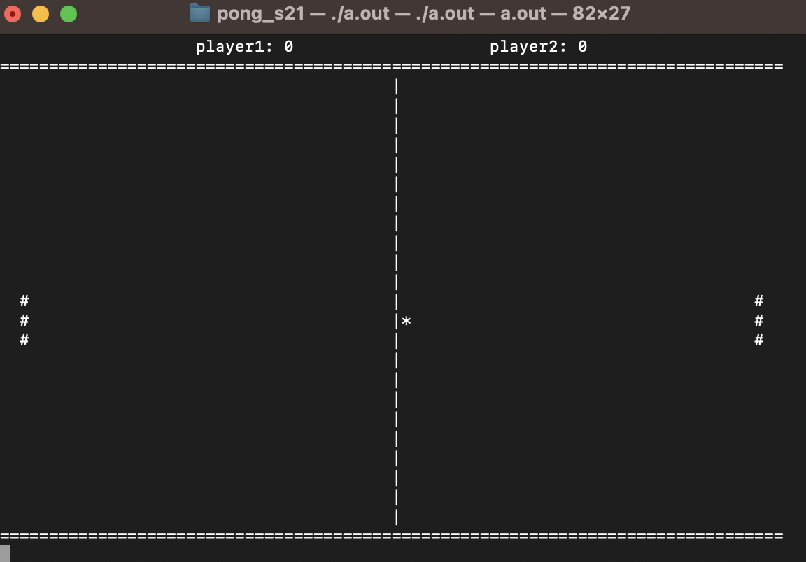
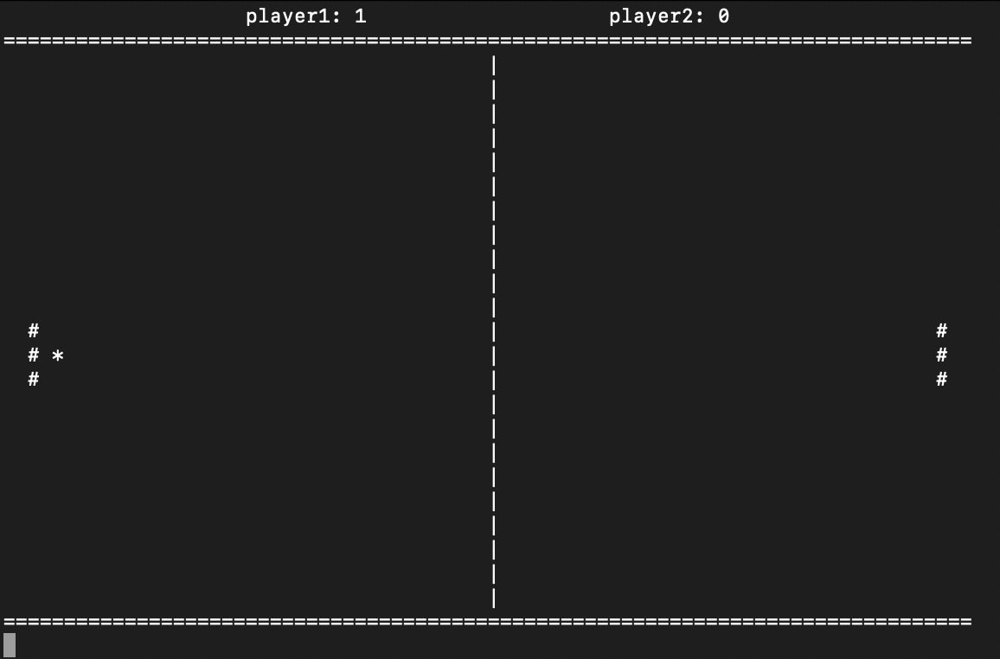

# pong_s21

### First group project. We have implemented a step-by-step version of the game of ping pong

### a simple interface was made inside the terminal

### And settup some rules for playing (a-z) - up and down keys for first player and (k-m) - up and down keys for second player.

